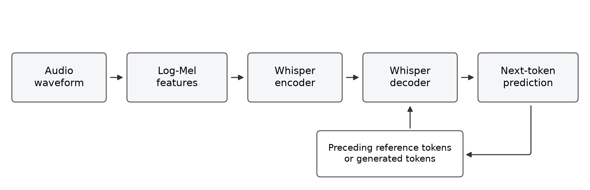
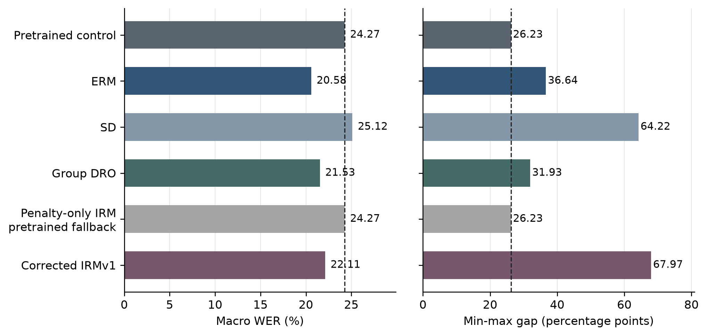
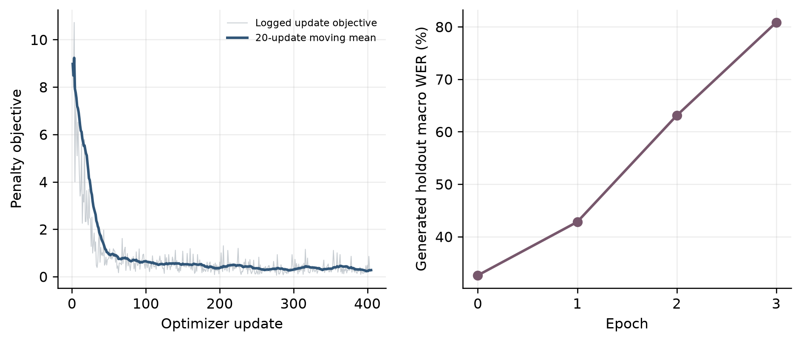
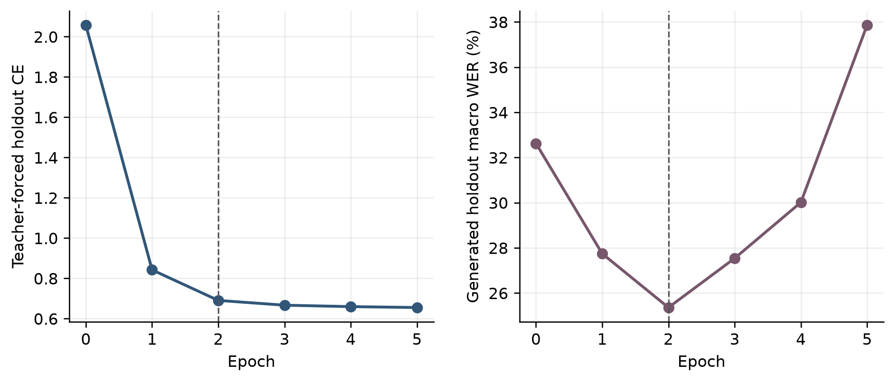

# Accent Invariant Automatic Speech Recognition

Deep Learning Project Report

5 October 2026

## Abstract

We investigated whether fairness-oriented fine-tuning can improve English speech recognition across accent and linguistic-background groups. We adapted the multilingual Whisper Small model to the Edinburgh International Accents of English Corpus using low-rank adapters and compared empirical risk minimization, spectral decoupling, Group Distributionally Robust Optimization and Invariant Risk Minimization. The experiment used 4,294 training utterances, a speaker-disjoint holdout of 2,402 utterances and 9,079 scorable test utterances spanning 26 groups. Fourteen matching groups were available for supervised training.

ERM reduced test macro word error rate from 24.27% to 20.58%, Group DRO to 21.53%, and corrected IRMv1 to 22.11%. However, their min-max gaps increased from the pretrained control's 26.23 percentage points to 36.64, 31.93 and 67.97 points respectively. Spectral decoupling worsened both metrics. A penalty-only IRM ablation degraded holdout transcription despite a decreasing objective; checkpoint selection retained the pretrained model, explaining its identical baseline result. Corrected IRMv1 produced genuine adapter updates, but severe over-generation on a small number of utterances caused a large test disparity. No trained method achieved the combined accuracy and disparity goal. The study demonstrates the need to distinguish mathematical objective correctness, teacher-forced loss, free-running transcription and group-level generalization.

Keywords: automatic speech recognition, Transformer, transfer learning, LoRA, fairness, Group DRO, spectral decoupling, IRMv1, word error rate.

## Contents

[[CONTENTS]]

## 1 Introduction

Automatic speech recognition converts an audio recording into a written transcription. Its usefulness depends on how reliably it recognizes the speech of different users. A model may achieve a strong average result while making substantially more errors for particular accents. Such differences can be hidden by a single aggregate score.

Our project asks whether supervised adaptation of a pretrained model can simultaneously improve recognition accuracy and reduce disparities across accent groups. We use two complementary measures: macro word error rate, which averages group WER equally, and the min-max gap, which measures the difference between the highest and lowest group WER. Both should decrease relative to the same pretrained control to meet the project goal.

The reference study is Towards Fair ASR For Second Language Speakers Using Fairness Prompted Finetuning by Swain and colleagues [1]. It evaluates Whisper and SeamlessM4T with standard and fairness-oriented objectives. Our scope is the multilingual Whisper Small backbone, EdAcc and the paper's 26 named evaluation groups. We implemented an optional Fusion objective, but no completed Fusion experiment is reported.

Fairness-prompted fine-tuning here means changing the optimization objective. It does not involve writing a natural-language fairness instruction for the model. The group labels influence sampling, training losses and evaluation; the output task remains English transcription.

This is a research implementation with declared assumptions. The paper does not fully specify the adapter architecture, every loss reduction, the standalone IRM training recipe or all preprocessing and decoding details. We therefore distinguish paper-specified values from implementation choices and do not claim exact reproduction.

## 2 Project Development and Experimental Sequence

The project began as a notebook-based implementation of the reference methods. Review focused on objective definitions, transcript handling, batch semantics, evaluation coverage and reliable checkpoint selection. We then established a shared pretrained control and a consistent scoring protocol for the retained completed experiments.

The final scientific sequence was ERM, SD, Group DRO, a penalty-only IRM ablation, and corrected IRMv1. Each technique started independently from the same pinned pretrained backbone. This was a comparison of adaptation recipes, rather than sequential training of one model through all methods.

| Run | Method | Trained epochs | Updates | Selected epoch |
|---|---|---:|---:|---:|
| 003 | ERM | 4 | 540 | 1 |
| 004 | SD | 5 | 675 | 2 |
| 005 | Group DRO | 5 | 675 | 2 |
| 007 | Penalty-only IRM | 3 | 405 | 0 |
| 008 | Corrected IRMv1 | 5 | 675 | 2 |

Table 1. Completed experiment sequence. Epoch 0 denotes retention of the pretrained predictor, not a trained checkpoint.

The identical result in run 007 prompted an investigation of the selected checkpoint and training objective. The investigation established that trained checkpoints performed worse on the holdout and were rejected. We then added prediction risk to standalone IRM, improved penalty estimation and numerical stability, and retained diagnostics that distinguish genuine parameter updates from pretrained fallback.

After experimentation, the implementation was consolidated into one canonical Python module and a generated notebook. Completed metrics, predictions, histories and selection records were preserved. Incomplete experiments and redundant draft records are absent from the curated research results. The retained evidence documents the completed scientific sequence; it does not reconstruct every exception from discarded drafts.

## 3 Dataset and Experimental Protocol

### 3 1 EdAcc and the prediction task

EdAcc is a corpus of conversational English with diverse speaker backgrounds [7]. Each retained utterance contains an audio waveform, reference transcript, speaker identifier and group label. The ASR model estimates an English token sequence from the waveform. The group identifier is used for training objectives and evaluation rather than as a transcription target.

| Partition | Utterances | Role |
|---|---:|---|
| Training | 4,294 | Adapter parameter updates |
| Holdout | 2,402 | Checkpoint selection and early stopping |
| Test | 9,079 | Final reported evaluation |

Table 2. Actual retained partition sizes.

The available public development or validation split supplied the training pool. A speaker-disjoint holdout was created within it. The configured fraction of 0.15 applies to speakers within each group, with safeguards for small groups. It is not a 15% random split of utterances. Speakers contribute different amounts of speech, so the resulting utterance proportions differ.

### 3 2 Speaker separation and data leakage

Data leakage occurs when information that should be reserved for evaluation influences training or model selection. Speech data requires particular care because utterances from one speaker share voice and pronunciation characteristics. Random utterance splitting can place the same voice in both training and holdout.

We separated speakers between training and holdout and checked for overlap between the training pool and official test speakers. The recorded training-pool and test overlap is empty. Final-test scores did not select epochs. These checks support the validity of the measured comparison, although they do not make all sources of distribution difference disappear.

### 3 3 Training environments and evaluation groups

The evaluation covers 26 accent or L1 groups. These describe linguistic background or English variety; they are not 26 different transcription languages. The grouping includes native English varieties as well as second-language accents.

Only 14 matching groups were present in the filtered training pool: Bulgarian, Catalan, French, Indian English, Irish English, Italian, Jamaican English, Mainstream US English, Mandarin, Romanian, Scottish English, Southern British English, Spanish and Vietnamese.

We used these groups as the environments for IRM. Their labels were available in the dataset and provided an interpretable partition of training distributions. The reference paper also mentions channel conditions and demographic metadata as possible environments. Those are examples of environment definitions, rather than a requirement to invent unavailable labels.

Twelve evaluated groups received no supervised examples in this training pool. They remained in the test evaluation. Missing training environments cannot be recovered by using their test recordings without invalidating the protocol. This limitation is relevant to fairness generalization, but it does not explain every failure: corrected IRM's worst test group was represented during training.

## 4 Audio and Transcript Preparation

### 4 1 Audio features

Waveforms were resampled to 16 kHz and transformed into 80-bin log-Mel features for Whisper Small. A waveform describes amplitude over time. A spectrogram represents frequency content over time; the Mel transform organizes frequencies on an auditory-motivated scale, while logarithmic compression reduces the range of feature magnitudes.

Feature extraction was performed once and cached. This avoids repeating audio decoding, resampling and feature computation in every epoch. Batches include feature masks so that valid audio positions can be distinguished from padding.

Whisper short-form processing uses 30-second windows. We excluded training recordings longer than 30 seconds because they did not have the segment-level alignment needed for safe supervised truncation. Taking an audio prefix while retaining a full-recording transcript would teach the model to predict words absent from its input. Proper long-recording training would require an additional alignment or segmentation procedure.

Long scorable test recordings were retained and transcribed with native long-form decoding. The training exclusion is therefore a declared protocol choice, not a silent shortening of the test.

### 4 2 Transcript cleanup and normalization

Event annotations are not necessarily spoken words. Training targets remove event tags and use lowercase lexical text. Ignored scoring regions and references with no lexical content are excluded under the declared transcript policy. Targets are tokenized after cleanup, and sequences exceeding the decoder limit are rejected with an exclusion record.

The source test contained 9,289 utterances. There were 210 ignored or nonlexical-reference exclusions, leaving 9,079 scorable utterances. The exclusions are counted explicitly in the data protocol. Scorable utterances were not removed merely because their predictions were poor.

WER normalization applies the same event-tag removal, lowercasing, ASCII-punctuation replacement and whitespace cleanup to both reference and hypothesis. Training target cleanup and evaluation normalization have related but distinct roles. For example, lexical punctuation can be retained in a target and normalized for word-level scoring.

Changing normalization, ignored-region handling or audio retention changes the evaluation task. Consequently, numerical comparisons with the paper require protocol compatibility rather than just the same dataset name.

## 5 Whisper and the Deep Learning Architecture

### 5 1 Sequence prediction with a Transformer

We used openai/whisper-small, the multilingual Small model, configured for English transcription. It contains approximately 244 million pretrained parameters. Its published configuration has 12 encoder layers, 12 decoder layers, a hidden dimension of 768 and 12 attention heads. It uses an 80-bin audio feature representation and a decoder position limit of 448 [2, 8].

The encoder receives log-Mel features through a convolutional frontend and contextualizes them with Transformer layers. The decoder produces text tokens autoregressively, conditioning on encoded audio and preceding tokens.

Self-attention relates positions within one sequence. In the encoder it connects audio positions; in the decoder causal masking prevents access to future text. Cross-attention lets decoder queries retrieve information from encoded audio. Feed-forward layers transform representations, while residual connections and layer normalization support effective optimization. Positional information communicates sequence order.

Figure 1. Audio processing and autoregressive text generation. During training, preceding reference tokens provide teacher-forced context.

### 5 2 Pretraining and transfer learning

Whisper's pretrained representations were learned from large-scale speech supervision [2]. We reused that model rather than constructing an ASR network from scratch. Transfer learning seeks to adapt existing knowledge to the target conversational speech distribution.

The pretrained control is the same Whisper Small checkpoint used to initialize the adaptation methods. It is not a larger model and was not selected after seeing which backbone gave the best test score. Each method starts from the same immutable model revision.

### 5 3 Low rank adaptation

Low-Rank Adaptation, or LoRA, freezes a pretrained weight matrix and learns a smaller update [3]. For an original matrix W, the adapted matrix is:

$$
W_{\mathrm{adapted}} = W + \frac{\alpha}{r}BA
$$

The trainable matrices A and B factor the update through rank r. Our adapter configuration uses rank 16, alpha 32 and dropout 0.05, targeting attention query and value projections. Query projections influence what attention searches for; value projections influence the information transmitted by attention.

This configuration adds approximately 1.77 million trainable adapter parameters, under 1% of the backbone parameter count. Fewer trainable parameters reduce gradient and optimizer-state requirements. LoRA still changes the effective network, and a small number of updated parameters can cause substantial changes in generated text.

The adapter architecture is an implementation assumption because the reference paper describes lightweight adapters without a complete architecture specification.

## 6 Supervised Loss and Optimization

### 6 1 Logits and cross entropy

At each decoder position, logits are scores over vocabulary tokens. Softmax converts them into a probability distribution. Cross-entropy penalizes a low probability for the correct token:

$$
p_k = \frac{\exp(z_k)}{\sum_j \exp(z_j)}, \qquad \ell(z,y) = -\log p_y
$$

Targets are subword tokens, which may represent complete words or word pieces. Training uses teacher forcing: the decoder receives the correct preceding tokens when predicting the next token. Inputs must be shifted correctly relative to target labels. Padding labels use -100 and contribute no supervised loss.

For the default reduction, valid-token cross-entropy is averaged within each utterance and then across utterances:

$$
R_i = \frac{1}{T_i}\sum_{t=1}^{T_i}\ell_{it}, \qquad L_{\mathrm{ERM}} = \frac{1}{N}\sum_{i=1}^{N}R_i
$$

This gives every utterance equal weight. A token-level mean over the entire batch gives longer targets more influence. The implementation supports a declared token-mean alternative for naturally sampled ERM and SD, but the completed experiments use utterance-mean risk.

### 6 2 Backpropagation and AdamW

A forward pass produces logits and the selected objective. Backpropagation applies the chain rule to compute adapter gradients. AdamW maintains moving estimates of gradients and squared gradients to scale parameter updates adaptively, with decoupled weight decay.

The explicit ERM objective contains only cross-entropy. Nevertheless, AdamW weight decay, LoRA dropout and gradient clipping still influence its optimization. Logging or differentiating unrelated fairness objectives is not necessary for an ERM update.

| Setting | Value |
|---|---|
| Learning rate | 0.00004 constant |
| AdamW weight decay | 0.01 |
| Effective batch size | 32 utterances |
| LoRA rank and alpha | 16 and 32 |
| LoRA dropout | 0.05 |
| Gradient clipping threshold | 1.0 |
| Seed | 42 |
| Maximum epochs | 10 |
| Early stopping patience | 3 |

Table 3. Shared numerical recipe. Sampling and checkpoint eligibility differ by method.

### 6 3 Microbatches and accumulation

ERM and SD use physical batches of four examples and accumulate eight microbatches before an optimizer update, yielding an effective batch of 32. Each microbatch contributes a weighted gradient. Final incomplete accumulation windows require correct example weighting so that smaller batches do not disproportionately influence the update.

The history's microbatches field records the constituent forward and backward calculations: examples, objective components and accumulation weights. A microbatch is not a different model or a different fine-tuning technique.

Standalone DRO and corrected IRM require one physical batch of 32 with no accumulation. Their group maximum and invariance penalty are nonlinear batch functions, so an average of independently computed microbatch objectives generally differs from the intended full-batch objective.

## 7 Fine Tuning Objectives

### 7 1 Empirical risk minimization

ERM minimizes average supervised transcription risk. Natural shuffled sampling visits the training examples without explicit group balancing. Groups with more examples therefore contribute more of the pooled objective.

This approach directly targets prediction, but it provides no explicit protection against deteriorating performance for particular groups. Average risk can improve while minority-group or worst-group performance worsens.

Run 003 completed four epochs and 540 updates. Epoch 1 was selected. It reduced test macro-WER to 20.58%, approximately a 15.2% relative improvement over the control, but increased the gap to 36.64 points.

### 7 2 Spectral decoupling

SD adds a squared-logit penalty to ERM:

$$
L_{\mathrm{SD}} = L_{\mathrm{ERM}} + \lambda_{\mathrm{inner}}P_{\mathrm{logits}}
$$

The motivation relates to gradient starvation: a network can learn a subset of predictive features that quickly reduces cross-entropy while other useful features remain poorly learned [4]. Our penalty is the normalized mean of squared valid logits, averaged within utterances and then across utterances. The assumed inner coefficient is 0.06.

The first recorded microbatch had ERM loss 2.027 and logit penalty 165.445. Multiplication by 0.06 produces a penalty contribution of 9.927, almost five times the prediction-loss contribution. Its complete SD objective was approximately 11.954.

Run 004 selected epoch 2 after five epochs and 675 updates. Test macro-WER was 25.12% and gap 64.22 points. Both worsened. The large initial regularization contribution is a confirmed observation and a plausible contributor to failure; its causal effect has not been isolated by a controlled coefficient sweep.

Raw logit magnitude is also not identical to probability confidence. Softmax depends on relative logits and is unchanged by a common additive offset. Penalizing raw magnitudes does not by itself establish better calibration or transcription.

### 7 3 Group distributionally robust optimization

For each represented group g, compute mean utterance risk R_g. The implemented objective follows the ASR paper's displayed maximum:

$$
L_{\mathrm{DRO}} = \max_{g \in G_{\mathrm{train}}}R_g
$$

The highest-risk group drives the update. Balanced sampling represents all observed training groups and oversamples rare groups with replacement. An epoch in this sampler is an epoch-length collection of sampled batches, rather than a guarantee that every original example appears exactly once.

Full physical batches matter because the mean of microbatch maxima is generally not the maximum of the combined group risks. A validation check prevents silently replacing this objective with an accumulation approximation.

Run 005 selected epoch 2 after five epochs and 675 updates. It achieved macro-WER 21.53% and gap 31.93 points. It improved average recognition and had the smallest gap among the selected trained models, but still exceeded the control's gap.

Worst-group training CE and worst-group test WER are different quantities. The group estimates use relatively few examples per batch, unseen test groups lack supervised coverage, and generalization can remain poor even when training loss decreases. The original Group DRO work also emphasizes regularization and early stopping for worst-group generalization [5].

### 7 4 Invariant risk minimization

IRM seeks a predictor that remains suitable across training environments. We introduce a fixed dummy scalar w multiplying model logits. For each environment e, measure the derivative of its prediction risk at w equal to one:

$$
d_e = \left.\frac{\partial R_e(wz)}{\partial w}\right|_{w=1}
$$

A small derivative indicates that changing this common scale does not locally improve risk much in that environment. This is an invariance surrogate; it does not prove that every internal feature is independent of accent or that causal speech representations have been discovered.

The supplied paper displays a penalty-only Eq. 4 and leaves standalone IRM details unclear. Run 007 used this literal standalone penalty interpretation. Its logged objective fell from approximately 8.97 at the first update to 0.30 at the last, while holdout transcription deteriorated sharply. Predictive performance was not directly required by that objective.

A representation can reduce an invariance penalty without becoming a useful transcriber. The records demonstrate severe deterioration, but do not establish a particular collapse mechanism such as perfectly uniform token probabilities.

We changed standalone IRM to a predictive IRMv1 formulation:

$$
L_{\mathrm{IRMv1}} = \frac{1}{|E|}\sum_e R_e + \beta\frac{1}{|E|}\sum_e P_e
$$

Prediction risk and penalty average environments equally. The risk term is therefore not the same pooled, example-weighted ERM reduction. The original IRM formulation includes both prediction risk and an invariance penalty [6]. Our beta value of 1.0 is a declared starting assumption.

For independent per-example scalar derivatives d_i within an environment, the corrected implementation uses:

$$
P_e = \frac{1}{n_e(n_e-1)}\sum_{i \neq j}d_i d_j
$$

Squaring a noisy sample mean includes a variance contribution. The distinct-pair product estimates the square of the expected derivative without self-products. It requires at least two independent draws per environment. A finite-batch estimate can be negative; clamping it to zero would introduce bias.

Corrected IRM represents all 14 environments in a physical batch of 32 and checks for at least two draws per environment. Run 008 completed five epochs and 675 updates, selected trained epoch 2 and achieved test macro-WER 22.11% with a gap of 67.97 points. Diagnostics show changes in all 144 adapter tensors.

### 7 5 Fusion

The optional Fusion objective combines the terms in the reference paper:

$$
L_{\mathrm{Fusion}} = \lambda_eL_{\mathrm{ERM}} + \lambda_sL_{\mathrm{SD}} + \lambda_dL_{\mathrm{DRO}} + \lambda_iL_{\mathrm{IRM,penalty}}
$$

The outer coefficients are 1, 0.06, 1 and 0.01. SD already contains ERM. With our assumed inner SD coefficient, the expanded expression is:

$$
L_{\mathrm{Fusion}} = 1.06L_{\mathrm{ERM}} + 0.0036P_{\mathrm{logits}} + L_{\mathrm{DRO}} + 0.01L_{\mathrm{IRM,penalty}}
$$

The outer SD coefficient and inner SD penalty coefficient must not be confused. Fusion retains the paper's squared-mean IRM penalty term; the standalone predictive IRMv1 correction does not silently add another prediction-risk term to Fusion.

Balanced sampling changes example frequency. Importance weights correct Fusion's pooled ERM and SD components to retain their empirical-risk interpretation. Fusion retains a documented microbatch approximation that requires separate review before a rigorous reported experiment. No measured Fusion improvement is claimed.

## 8 Inference and Evaluation

### 8 1 Autoregressive decoding

Inference generates text using the model's own preceding predictions rather than reference tokens. We use greedy decoding with one beam and no sampling. Short recordings use a new-token limit of 440; native long-form decoding respects the total 448-position decoder budget while processing complete long audio.

Teacher forcing and free-running generation expose the model to different contexts. An incorrect generated token can affect subsequent predictions and cause errors to compound. This exposure-bias mechanism is relevant to the observed loss and WER mismatch, but the study does not isolate it as the sole cause of failure.

Inference uses evaluation mode, disables gradient tracking, and enables decoder caching. Predictions are saved per utterance and validated before reuse. Sorting for batching changes file order, so models should be compared by utterance ID rather than by JSONL line number.

### 8 2 Word error rate

WER aligns reference and hypothesis words and counts substitutions S, deletions D and insertions I over N reference words:

$$
\mathrm{WER} = 100\frac{S+D+I}{N}
$$

For the reference "I like green tea" and hypothesis "I like tea", one deletion over four reference words gives 25% WER. Insertions can make WER exceed 100%; a large value is not automatically a metric error.

The implementation aggregates word-error counts within each group and computes corpus WER. It then averages group WER equally:

$$
\mathrm{MacroWER} = \frac{1}{26}\sum_{g=1}^{26}\mathrm{WER}_g
$$

The disparity measure is:

$$
\mathrm{Gap} = \max_g \mathrm{WER}_g - \min_g \mathrm{WER}_g
$$

The gap is measured in percentage points. A smaller gap alone can be misleading if all groups become inaccurate, and a larger gap can arise because the best group improves disproportionately. We therefore interpret both metrics together and inspect the maximum group WER and its error counts.

Within-group corpus WER differs from averaging individual-utterance WERs. A supplementary aggregation comparison is implemented to inspect this sensitivity without changing primary metrics or selecting checkpoints after observing test results.

### 8 3 Selection and early stopping

The zero-update predictor is evaluated on the same complete holdout before training. ERM checkpoints must improve both holdout macro-WER and gap over this control; eligible checkpoints are ranked by macro-WER. Other completed methods select by holdout macro-WER. The minimum macro improvement is 0.1 percentage points and patience is three epochs.

When no trained checkpoint qualifies, epoch 0 remains selected and is explicitly labelled pretrained retention. Corrected IRM also retains and reports the best trained checkpoint separately. If it is the same checkpoint as the selected predictor, its test evaluation can be reused with explicit labels.

The holdout control's macro-WER was 32.63%, whereas the test control's was 24.27%. These are different evaluation partitions of the same predictor. Neither number should be substituted for the other in improvement calculations.

## 9 Experimental Results

All completed final-test evaluations use the same 9,079 scorable utterances and 26 groups. Lower values are better for both columns. The retained metrics and prediction evidence provide the basis for Table 4.

| Predictor | Selected epoch | Macro WER percent | Gap points |
|---|---:|---:|---:|
| Pretrained control | 0 | 24.27 | 26.23 |
| ERM | 1 | 20.58 | 36.64 |
| SD | 2 | 25.12 | 64.22 |
| Group DRO | 2 | 21.53 | 31.93 |
| Penalty-only IRM fallback | 0 | 24.27 | 26.23 |
| Corrected IRMv1 | 2 | 22.11 | 67.97 |

Table 4. Final measured results. The penalty-only IRM row reports the retained pretrained predictor.

Figure 2. Test accuracy and disparity compared with the pretrained control. Dashed reference lines mark control values. The penalty-only row is a fallback rather than a selected trained model.

ERM achieved the lowest macro-WER, with a 15.2% relative reduction. Group DRO reduced macro-WER by 11.3%, and corrected IRMv1 by 8.9%. SD increased macro-WER by approximately 3.5% relative to the control. These relative changes must be distinguished from percentage-point differences.

Every selected trained model had a larger gap than the pretrained control. Their maximum group WER also increased: the control's maximum was 39.09%, compared with 46.38% for ERM, 73.62% for SD, 41.80% for DRO and 76.60% for corrected IRM. The fairness failure therefore cannot be attributed only to a better minimum-group score widening the range.

ERM improved both required holdout metrics at its selected epoch, but failed the combined criterion on the final test. SD, DRO and corrected IRM selected on holdout macro-WER and did not have a gap constraint. Holdout eligibility cannot guarantee final-test improvement.

## 10 Failure Analysis

### 10 1 Penalty loss decreased while transcription worsened

Run 007 is the clearest objective-design failure. Its logged penalty decreased, while holdout WER rose with every trained epoch.

| Epoch | Holdout macro WER percent | Holdout gap points |
|---|---:|---:|
| 0 control | 32.63 | 44.17 |
| 1 | 42.81 | 53.41 |
| 2 | 63.09 | 176.02 |
| 3 | 80.83 | 360.89 |

Table 5. Penalty-only IRM holdout deterioration. WER-derived gaps can exceed 100 points because insertions can make group WER exceed 100%.

Figure 3. The logged penalty objective and generated holdout WER move in different directions. The objective plot summarizes different sampled batches, not repeated evaluations on one fixed batch.

The confirmed outcome is that 405 updates were recorded and no trained checkpoint qualified for selection. Epoch 0 was restored, so full-test predictions and metrics matched the pretrained control. Identical final predictions did not establish that adaptation succeeded or that the training code had simply skipped its optimization loop.

The objective did not require prediction accuracy. Adding predictive risk resolved that weakness in corrected IRMv1. This explains the methodological correction without claiming that the paper's authors necessarily used an inadequate standalone objective.

### 10 2 Corrected IRM improved conditional prediction but failed on generated text

For corrected IRM, holdout teacher-forced CE decreased from 2.058 before training to 0.655 at epoch 5. Generated holdout macro-WER reached its best value at epoch 2, then worsened. The selected epoch had holdout macro-WER 25.36% and gap 35.47 points.

| Epoch | Teacher forced CE | Generated holdout macro WER percent |
|---|---:|---:|
| 0 | 2.058 | 32.63 |
| 1 | 0.842 | 27.75 |
| 2 selected | 0.691 | 25.36 |
| 3 | 0.667 | 27.54 |
| 4 | 0.660 | 30.02 |
| 5 | 0.655 | 37.87 |

Table 6. Conditional token prediction and free-running transcription do not track the same outcome.

Figure 4. Teacher-forced loss continues decreasing after the best generated-transcription checkpoint. The vertical marker identifies selected epoch 2.

This demonstrates why a low training or teacher-forced validation loss is not a sufficient ASR success criterion. Overfitting, decoding instability and exposure bias are relevant hypotheses, but their separate causal contributions were not established.

### 10 3 A few severe generation errors dominated one group

Corrected IRM's Southern British English group had 178 test utterances and 2,885 reference words. It incurred 410 substitutions, 129 deletions and 1,671 insertions, giving 76.60% WER. Four recordings accounted for 74.4% of the group's 2,210 total word errors.

| Duration seconds | Reference words | Generated words | Word errors |
|---:|---:|---:|---:|
| 12.49 | 34 | 440 | 440 |
| 3.22 | 10 | 440 | 434 |
| 11.86 | 48 | 440 | 429 |
| 36.04 | 81 | 389 | 341 |

Table 7. Four severe corrected IRM outliers in Southern British English, ordered as in the retained error-analysis record.

The errors include extreme over-generation and repetition. A short recording with a ten-word reference produced 440 hypothesis words. These failures substantially raised group WER and the min-max gap even though macro-WER improved overall.

This group was represented during training, so missing supervised coverage is not a sufficient explanation. Removing the difficult utterances, capping WER or changing decoding after observing the test would conceal or alter the reported experiment. A revised decoding policy would need a new predefined validation protocol.

### 10 4 What can and cannot be concluded about each failure

ERM's measured failure is its worsened final-test disparity despite better macro-WER. The objective has no explicit worst-group protection, but that property alone does not isolate the full causal explanation.

SD's measured failure is deterioration in both metrics. Its unusually large initial penalty contribution provides a concrete reason to investigate loss scaling. Without an ablation, we cannot attribute the failure solely to the coefficient.

DRO's measured failure is a gap above the control despite targeting worst-group training risk. Training CE, limited group estimates and test generalization differ. The original method's rationale is not a guarantee of improved worst-group WER in this recipe.

Penalty-only IRM's confirmed failure is severe holdout deterioration followed by pretrained fallback. Corrected IRM fixes the missing prediction objective and demonstrates actual adapter changes, but still exhibits severe generated-text outliers. Correct code and successful optimization do not guarantee the research outcome.

## 11 Implementation Validation and Efficient Computation

### 11 1 Mathematical and numerical checks

Each method computes only its necessary statistics. ERM needs CE, SD needs CE and its logit penalty, DRO needs group CE risks, and corrected IRM needs environment risk and scalar derivatives. Fusion combines its configured terms.

The scalar derivative for a token is:

$$
\left.\frac{\partial \ell(wz,y)}{\partial w}\right|_{w=1} = \sum_k p_kz_k-z_y
$$

Large common logit offsets can cause cancellation when subtracting nearly equal floating-point quantities. The implementation centers logits before evaluating this derivative. A common shift leaves the mathematical derivative unchanged, and tests compare shifted and unshifted cases.

IRM training requires differentiating a quantity that is itself a risk derivative. The custom token-statistics operation uses an analytic backward for this chosen formulation and compares values and gradients against reference autograd. It processes valid tokens in chunks to avoid unnecessary large probability graphs.

Synthetic tests also check padded-label masking, decoder shifting, objective reductions, gradient accumulation, full-batch DRO semantics, IRM sample requirements and the separation between standalone IRMv1 and Fusion's paper penalty.

The retained suite has 47 passing synthetic and structural tests. This is evidence for specific properties, not proof that every conceivable bug is absent. The tests do not load a real ASR model or corpus.

### 11 2 Evaluation and checkpoint safeguards

Prediction reuse validates model, data and decoder identity along with utterance IDs, references and groups. Duplicate or stale records are rejected. Complete group coverage is required before reporting successful evaluation. Prediction checksums preserve the integrity of retained text.

Checkpoints record adapter weights, optimizer and scheduler state, gradient-scaler state, random-number state and the completed batch position. An unfinished accumulation window is replayed on resume. A changed configuration requires a new output directory rather than silent reuse.

Corrected IRM diagnostics measure teacher-forced CE, token entropy, confidence, token accuracy, scale derivatives, adapter changes and generated-text repetition. These distinguish optimization progress from predictor quality. They do not establish causal explanations on their own.

### 11 3 Efficient execution

Mixed precision reduces the cost of model operations, while sensitive loss computations use higher precision. FP16 execution supports gradient scaling. Efficient attention, fused AdamW, feature caching, prefetched data and memory-safe batch tuning reduce avoidable overhead.

Inference disables gradient tracking and reuses decoder key and value states. Selected LoRA adapters are merged into effective backbone weights for inference. Short recordings are batched separately from long recordings, and inference can reduce batch size after memory exhaustion.

These measures improve execution efficiency without changing the declared scoring rules. Deterministic seeds and pinned revisions improve repeatability, but floating-point behavior can still differ across environments.

## 12 Comparison With the Paper and Study Limitations

The paper's Whisper Small row reports a baseline macro-WER of 67.8% and gap of 120.5 points, ERM values of 32.9% and 39.4 points, and Fusion values of 30.3% and 45.1 points [1]. Its Small Fusion result improves macro-WER over ERM but does not improve the gap over ERM.

Our pretrained control is substantially better under our protocol, at 24.27% macro-WER and 26.23 points. We cannot infer that a newer and inherently better Whisper caused this discrepancy. Our backbone revision is fixed. Differences in scoring, decoding, data handling and unspecified experimental choices affect comparability, and the exact source of the baseline discrepancy has not been established.

LoRA architecture, SD normalization and its inner coefficient, standalone IRMv1 weighting, sampling, holdout construction and long-training exclusions are declared choices. Their effects have not all been isolated experimentally. The same model and dataset names do not make two protocols equivalent.

We used one backbone size and one seed. We did not estimate confidence intervals or run systematic coefficient searches. The trainable environment set has 14 groups, while final evaluation has 26. Per-group sample sizes differ, and extreme generation failures can strongly influence corpus WER in smaller groups.

The recipes also differ in sampling and checkpoint eligibility, not only in objective formula. ERM and SD use natural sampling; fairness methods use balanced sampling. ERM has a dual-metric holdout constraint, while other methods select by macro-WER. These comparisons therefore evaluate the implemented recipes rather than perfectly isolating one loss-term effect.

## 13 Future Work

Future experiments should vary SD and IRM regularization strengths using holdout data, retaining the same test protocol. Loss-scale measurements can help design coefficient ranges, but favorable test outcomes should not be used to choose those ranges retrospectively.

Repeated seeds and uncertainty estimates would establish whether method differences are stable. Because multiple utterances come from the same speaker, uncertainty analysis should account for speaker-level dependence rather than assuming every utterance is independent.

Generation failures require separate validation-driven investigation. Possible experiments include decoding constraints, stopping behavior, sequence-level regularization and alternative checkpoint-selection policies. These are proposals, not completed corrections to the retained results.

Additional labelled training coverage would allow direct study of currently unseen groups. Environment definitions based on reliable channel or demographic metadata could also be compared with accent-based environments when such information is available.

Fusion requires review of its batch approximation before a controlled complete experiment. Broader comparisons could include other model sizes, full fine-tuning versus LoRA, or alternative adapter locations. Each comparison should identify which training and selection factors change.

## 14 Conclusion

We implemented a reproducible ASR adaptation pipeline and compared ERM, SD, Group DRO and two standalone IRM interpretations on the same retained test set. ERM achieved the strongest macro-WER, and Group DRO had the smallest gap among selected trained models. No trained method improved both test macro-WER and the min-max gap over the pretrained control.

The penalty-only IRM ablation showed that a decreasing invariance objective can accompany severe transcription degradation. Checkpoint fallback explained its identical baseline output. Corrected IRMv1 restored predictive learning and produced measurable adapter changes, but a few severe generation outliers caused a large disparity on the final test.

The central deep learning lesson is that objective correctness, optimizer progress, conditional prediction quality and generated-transcription fairness are distinct properties. A convincing ASR study must examine all of them, report negative outcomes and preserve the evidence needed to interpret failures.

## Appendix A Research Artifacts and Reproduction Settings

The canonical implementation is fair_asr_core.py and the generated entry notebook is notebooks/fair_asr.ipynb. The notebook installs ASR dependencies in its kernel, prepares the dataset, validates the model pipeline and runs selected independent methods.

Each completed experiment retains scientific settings, data protocol, measured results, group WER, training history, checkpoint selection and predictions. Configurations describe historical recipes; curated result folders are not live checkpoint-resume directories. Model weights are not bundled.

| Artifact | Scientific purpose |
|---|---|
| config.json | Revisions, numerical recipe and physical batching |
| data_protocol.json | Split sizes, group coverage and exclusions |
| measured_results.json | Full-precision metrics and word-error counts |
| results.csv | Method-level metric comparison |
| per_accent_wer.csv | Group-level performance |
| history.json | Updates, constituent losses and holdout scores |
| selection.json | Selected epoch, eligibility and predictor role |
| predictions JSONL | Original reference and hypothesis evidence |
| prediction_checksums.json | Content integrity for saved predictions |

Table 8. Roles of retained scientific artifacts.

The model revision is 973afd24965f72e36ca33b3055d56a652f456b4d. The EdAcc revision is d9ae7bd344f0562b766ec93ee5ce8f2f9568ce66. The completed recipes used PyTorch 2.8.0, Transformers 4.46.3, PEFT 0.13.2, Datasets 3.1.0, Accelerate 1.2.1 and Jiwer 4.0.0. Exact additional package versions are retained in experiment configurations.

## Appendix B Per Group Test Word Error Rate

| Accent group | Control | ERM | SD | DRO | IRM |
|---|---:|---:|---:|---:|---:|
| Bulgarian | 22.69 | 14.30 | 14.79 | 18.16 | 13.81 |
| Catalan | 28.52 | 19.82 | 26.51 | 26.88 | 19.89 |
| Filipino | 17.27 | 15.98 | 15.77 | 16.04 | 14.68 |
| French | 12.86 | 9.74 | 9.94 | 9.87 | 8.64 |
| Ghanain English | 22.88 | 14.68 | 14.64 | 15.97 | 14.62 |
| Hebrew | 22.74 | 14.35 | 14.24 | 15.33 | 13.35 |
| Hindi | 17.80 | 10.88 | 10.64 | 11.85 | 10.41 |
| Indian English | 18.23 | 14.44 | 17.63 | 15.28 | 14.43 |
| Indonesian | 23.82 | 16.92 | 15.79 | 17.49 | 16.27 |
| Irish English | 16.36 | 12.91 | 23.84 | 18.33 | 12.92 |
| Italian | 20.24 | 15.28 | 15.38 | 26.36 | 25.03 |
| Jamaican English | 28.24 | 28.64 | 32.09 | 25.92 | 25.37 |
| Kenyan English | 32.46 | 26.48 | 36.02 | 26.32 | 29.79 |
| Lithuanian | 26.73 | 14.78 | 15.22 | 15.65 | 17.95 |
| Mainstream US English | 21.83 | 26.83 | 23.63 | 32.11 | 22.79 |
| Mandarin | 21.76 | 21.27 | 44.72 | 20.48 | 18.73 |
| Nigerian English | 29.06 | 29.11 | 33.85 | 36.43 | 36.26 |
| Romanian | 30.39 | 31.46 | 22.78 | 25.57 | 22.10 |
| Scottish English | 24.41 | 20.48 | 39.13 | 21.23 | 20.72 |
| Sinhalese | 24.60 | 17.49 | 17.98 | 20.28 | 17.56 |
| Southern British English | 26.72 | 46.38 | 37.12 | 21.63 | 76.60 |
| Spanish | 24.24 | 18.33 | 28.93 | 19.27 | 18.43 |
| Spanish (Mexican) | 39.09 | 28.66 | 73.62 | 30.51 | 26.49 |
| Tagalog | 14.46 | 10.54 | 9.39 | 11.01 | 10.07 |
| Urdu | 25.86 | 18.52 | 19.38 | 20.06 | 18.69 |
| Vietnamese | 37.70 | 36.78 | 39.99 | 41.80 | 49.36 |

Table 9. Corpus WER in percent for each of the 26 evaluation groups. IRM means the selected corrected IRMv1 predictor. Penalty-only IRM is omitted because its selected predictor matches the control.

Group names preserve the dataset and paper mapping, including the source spelling Ghanain English. These are evaluation labels, not a claim that all groups represent different spoken languages.

## References

[1] Swain M, Maji B, Mishra J, Schedl M, Sogaard A and Jensen J R. Towards Fair ASR For Second Language Speakers Using Fairness Prompted Finetuning. arXiv 2510.18374v2, 2026. https://arxiv.org/abs/2510.18374

[2] Radford A and colleagues. Robust Speech Recognition via Large Scale Weak Supervision. 2022. https://cdn.openai.com/papers/whisper.pdf

[3] Hu E J and colleagues. LoRA Low Rank Adaptation of Large Language Models. 2021. https://arxiv.org/abs/2106.09685

[4] Pezeshki M and colleagues. Gradient Starvation A Learning Proclivity in Neural Networks. NeurIPS 2021. https://arxiv.org/abs/2011.09468

[5] Sagawa S, Koh P W, Hashimoto T B and Liang P. Distributionally Robust Neural Networks for Group Shifts On the Importance of Regularization for Worst Case Generalization. 2020. https://arxiv.org/abs/1911.08731

[6] Arjovsky M, Bottou L, Gulrajani I and Lopez-Paz D. Invariant Risk Minimization. 2020. https://arxiv.org/abs/1907.02893

[7] Edinburgh International Accents of English Corpus. Dataset and scoring resources. https://huggingface.co/datasets/edinburghcstr/edacc and https://groups.inf.ed.ac.uk/edacc/leaderboard.html

[8] OpenAI Whisper Small model configuration and implementation. https://huggingface.co/openai/whisper-small/blob/main/config.json and https://github.com/openai/whisper

[9] Project implementation and completed experiment records. fair_asr_core.py; runs/index.json; runs/run_003_erm; runs/run_004_sd; runs/run_005_group_dro; runs/run_007_irm_penalty_only; runs/run_008_irm.
